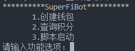

## ZAAR.SUPERFI.GG 脚本

### 打赏(对我很重要)

EVM：0x72691a36ED1fAC3b197Fb42612Dc15a8958bf9f2

### 启动

#### 1.环境

Node.js >14

python>3.8

#### 2.安装依赖库

* 进入项目目录
* pip install -r requirements.txt
* npm install

#### 3.配置项目

* 配置.env
* 配置社交账户token，创建钱包后系统自动按顺序匹配社交账号,格式如下

```json
[
    {
        "Twitter_Token":"xxx",
        "Discord_Token":"xxxx"
    },{
        "Twitter_Token":"xxx",
        "Discord_Token":"xxxx"
    },{
        "Twitter_Token":"xxx",
        "Discord_Token":"xxxx"
    },{
        "Twitter_Token":"xxx",
        "Discord_Token":"xxxx"
    }
]
```

#### 4.启动项目

* 运行python main.py
* 功能1创建钱包后功能3运行


